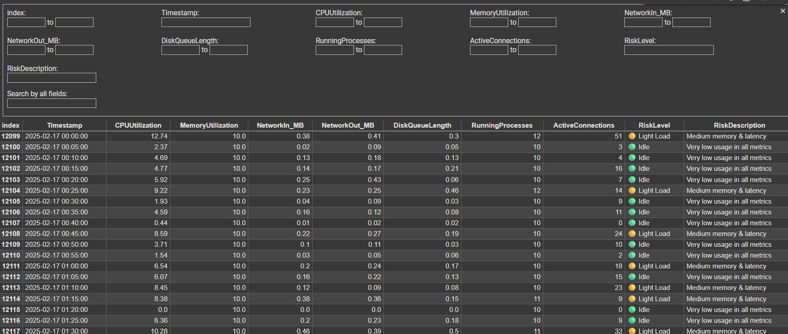
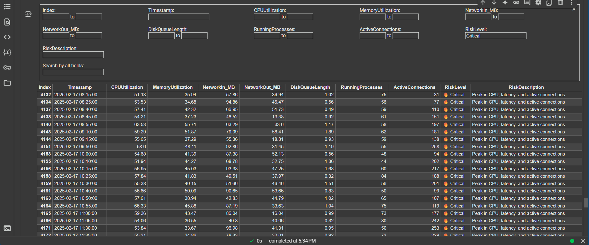

# AWS CloudWatch Anomaly Detection & Clustering Dashboard

This project provides an end-to-end framework to stream, cluster, and visualize performance metrics from AWS CloudWatch using multiple unsupervised learning techniques.

---

## 📌 Objective

Detect performance anomalies from CloudWatch logs and group system behavior patterns into risk-based clusters using unsupervised machine learning — with free-tier AWS services and open-source Python tooling.

---

## Motivation & Purpose
Cloud applications power critical business operations and services.
Even brief performance incidents or anomalies can cause significant financial, reputational, and operational impact.
Manual detection is often too slow, leading to delayed incident response and longer downtime.

Data-driven, automated anomaly detection enables:
Proactive incident management
Better resource optimization and cost savings
Enhanced service reliability and user experience
Our goal: Leverage unsupervised learning to detect, profile, and explain anomalies in real-world cloud application metrics.

## 📊 Features

- 📥 Stream data from CloudWatch CSV (simulated or real-time via Kinesis)
- 📈 Feature Engineering & Scaling
- 🤖 Clustering Models:
  - KMeans with Elbow Method
  - DBSCAN for noise detection
  - Ensemble Clustering (KMeans + DBSCAN)
  - Hierarchical Clustering with Dendrogram
  - KMedoids (robust clustering)
- 🧠 Risk-based cluster labeling (Idle, Normal, High Load, Critical)
- 🔥 Anomaly identification using latency, CPU, and active connections
- 📊 Heatmaps for per-feature intensity
- 🧬 PCA-based visualizations
- 📌 Auto risk-tagging & alert logic (planned for Lambda/SNS integration)

---

## Project Flow
### 📥 Stream Metrics via Kinesis
- A Python script reads metric rows from a CSV file.
- Each row is serialized to a Kinesis Data Stream (cloudwatch-metrics-stream).

### 🤖 Predict Cluster (Risk) Label in Lambda

- A Lambda function is triggered on each Kinesis record.
- It loads a pre-trained clustering model (KMeans, DBSCAN, etc.) and scaler.
- The metric data is transformed, and a cluster label (risk level) is predicted.

### Display in Dashboard
Our dashboard fetches labeled risk levels of instances in real time.

Displays:
- Risk label distribution (e.g., bar chart)
- Recent metrics with anomaly highlights
- Future Work: time-series trends within the dashboard for better instance health monitoring

### Trigger Alerts

If the predicted cluster label matches a known anomaly or high-risk cluster:
- Sends an SNS alert (email, Slack, etc.)

---

## 🛠️ Tech Stack

- Python 3.x
- Pandas, NumPy
- scikit-learn, scikit-learn-extra
- Seaborn, Matplotlib
- AWS CloudWatch (data source), Kinesis
- SageMaker or Lambda (for real-time inference deployment - optional)

---

## Dashboard Preview

- 
- 

---

## Limitations & Assumptions

- Data limitations:
Dataset lacks explicit labeled failures/incidents—evaluation is fully unsupervised.
- Assumptions:
Selected 10 core features are representative of overall cloud resource behavior.
Clusters identified via unsupervised learning truly reflect distinct operational states and anomalies.
Hyperparameter tuning (k, eps, min_samples) was performed using a limited grid due and might not be the same for all cloud scenarios.
- Model limitations:
Some true anomalies may be missed if they do not create clear feature separation.
Real-time applicability and generalizability to other cloud workloads need further validation.

---

## Future Scope

- Cross-Service Anomaly Correlation:
Expand the project to correlate with more anomalies across AWS services (e.g., EC2, RDS, S3) to detect systemic issues and complex failure chains in distributed systems.

- Alert Optimization:
Incorporate classification models to predict risk severity proactively (before anomaly occurs) and optimize alert thresholds to reduce false positives/alert fatigue.

- Incorporate feedback loop: 
Integrate engineer-validated incident labels to retrain and refine anomaly models (semi-supervised learning).

More Interactive Dashboards: Display additional system health data to enable enhanced monitoring.

---

